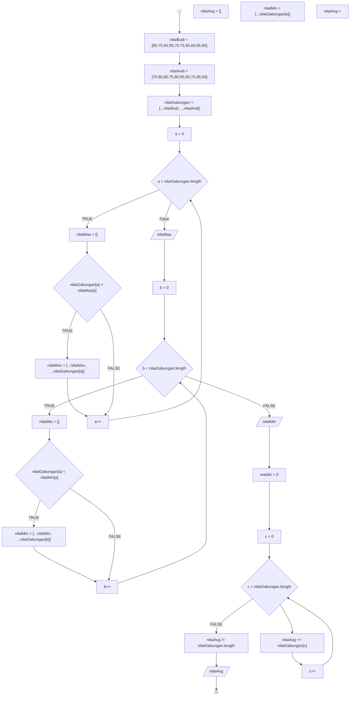

# Javascript 4

## Minitask 1

### Program hitung Max, Min, Average

### Flowchart

```mermaid

  flowchart TD

  A@{shape: sm-circ, label: "Start"}
  B@{shape: fr-circ, label: "End"}
  C@{shape: rect, label: "nilaiBudi = [80,75,90,95,70,75,95,60,65,80]"}
  D@{shape: rect, label: "nilaiAndi = [70,80,80,75,80,85,65,75,85,50]"}
  E@{shape: rect, label: "nilaiGabungan = [...nilaiBudi, ...nilaiAndi]"}
  F@{shape: rect, label: "nilaiMax = []"}
  G@{shape: rect, label: "nilaiMin = []"}
  H@{shape: rect, label: "nilaiAvg = []"}
  I@{shape: diam, label: "a < nilaiGabungan.length"}
  J@{shape: rect, label: "a = 0"}
  K@{shape: diam, label: "nilaiGabungan[a] > nilaiMax[a]"}
  M@{shape: rect, label: "nilaiMax = [...nilaiMax, ...nilaiGabungan[a]]"}
  N@{shape: diam, label: "nilaiGabungan[a] < nilaiMin[a]"}
  O@{shape: rect, label: "nilaiMin = [...nilaiGabungan[a]]"}
  P@{shape: rect, label: "a++"}
  Q@{shape: lean-r, label: "nilaiMax"}
  R@{shape: rect, label: "b = 0"}
  S@{shape: diam, label: "b < nilaiGabungan.length"}
  T@{shape: rect, label: "nilaiMin = [...nilaiMin, ...nilaiGabungan[b]]"}
  U@{shape: rect, label: "b++"}
  V@{shape: lean-r, label: "nilaiMin"}
  W@{shape: rect, label: "c = 0"}
  X@{shape: diam, label: "c < nilaiGabungan.length"}
  Y@{shape: lean-r, label: "nilaiAvg"}
  AA@{shape: rect, label: "nilaiAvg += nilaiGabungan[c]"}
  BB@{shape: rect, label: "wadah = 0"}
  CC@{shape: rect, label: "c++"}
  DD@{shape: rect, label: "nilaiAvg /= nilaiGabungan.length"}
  EE@{shape: rect, label: "nilaiAvg = "}

  A --> C --> D --> E --> J --> I --TRUE--> F --> K --TRUE--> M --> P

  K --FALSE--> P --> I

  I --False--> Q --> R --> S --TRUE--> G --> N --TRUE--> T --> U

  N --FALSE--> U --> S

  S --FALSE--> V --> BB--> W --> X --> AA --> CC --> X

  X --FALSE--> DD --> Y --> B


```
